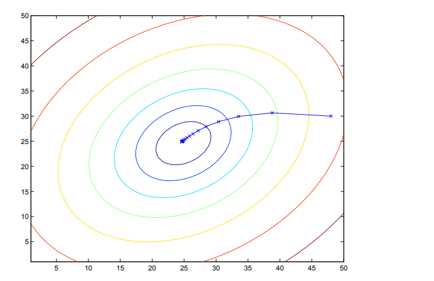

## Before We Start

**Roadmap**  
- **Supervised Learning**: Linear and logistic regression, generalized linear models (GLMs), generative learning (Gaussian discriminant analysis and Naive Bayes), and support vector machines (SVMs).  
- **Learning Theory**: Bias-variance tradeoff, regularization techniques, and model selection strategies.  
- **Deep Learning**: Tree ensembles, neural network fundamentals, and backpropagation.  
- **Unsupervised Learning**: K-means clustering, the EM algorithm, principal component analysis (PCA), and independent component analysis (ICA).  
- **Reinforcement Learning**: Markov decision processes (MDPs), Bellman equations, linear quadratic regulation (LQR) and Gaussian (LQG), and Q-learning.  

**Resources**: 
- [Course Repository (Autumn 2018)](https://github.com/maxim5/cs229-2018-autumn)  
- [详解正规方程（Normal Equation）](https://zhuanlan.zhihu.com/p/60719445?spm=a2c6h.13046898.0.0.7e436ffaYvMwh0)
- [机器学习中的数学理论1：三步搞定矩阵求导](https://zhuanlan.zhihu.com/p/262751195)
- [matrix vector derivatives for machine learning](https://daiwk.github.io/assets/matrix+vector+derivatives+for+machine+learning.pdf)

I skipped the lectures entirely—I read only the lecture notes and worked through all the assignments.

---

## Supervised Learning

To train a supervised learning model, we start by choosing a *hypothesis function* $h$, which maps input features $x$ to a predicted target output $y$:  
$$
    h_{\theta}(x) = \sum_{i = 0}^n \theta_i x_i = \theta^T x
$$  
The parameters $\theta_i$ (often called *weights*) define the model’s behavior.

To measure how well these weights fit the training data, we define a *cost function*:  
$$
    J(\theta) = \dfrac{1}{2}\sum_{i = 1}^m \big(h_\theta(x^{(i)}) - y^{(i)}\big)^2
$$  
This is the classic *ordinary least squares* (OLS) objective: it computes the average squared error between the model’s predictions and the true labels.

### Part I Linear Regression


#### 1. LMS alogorithm
**LMS** stands for **Least Mean Squares**. 

The LMS algorithm (also known as the **Widrow-Hoff learning rule**) is a parameter update rule based on **gradient descent**. Its goal is to adjust the model parameters $\theta$ so that the **squared error** between the prediction $h_\theta(x)$ and the true label $y$ is minimized.

The LMS update rule is:

$$ \theta_j := \theta_j + \alpha (y^{(i)} - h_\theta(x^{(i)})) x_j^{(i)} $$

*   $\alpha$: the **learning rate**, controlling the step size.
*   $y^{(i)} - h_\theta(x^{(i)})$: the **prediction error** (true value minus predicted value).
*   $x_j^{(i)}$: the $j$-th feature of the $i$-th training example.

There are two main implementation variants (optimization strategies) of LMS:

1.  **Batch Gradient Descent**: It processes *all* training examples, computes a single aggregate error across the full dataset, and then updates the parameters *once*.

```python
# Core logic for Batch Gradient Descent
for _ in range(iterations):
    # Calculate predictions for the entire batch: h_theta(x)
    predictions = X @ theta 
    
    # Calculate the error vector: (y - h_theta(x))
    errors = y - predictions
    
    # Update all theta_j simultaneously using the sum of errors
    # X.T @ errors performs the summation: sum((y - h) * x_j)
    theta += alpha * (X.T @ errors)
```
2. **Stochastic Gradient Descent (SGD)**: With SGD, we update the parameters *immediately* after processing *each individual training example*, using only that sample’s prediction error. This often leads to faster convergence—especially on large datasets. Crucially, this per-sample update rule *is* the LMS (Least Mean Squares) rule.
```python
# Core logic for Stochastic Gradient Descent
for _ in range(epochs):
    for i in range(m):
        # Pick one specific example (x_i, y_i)
        xi = X[i]
        yi = y[i]
        
        # Calculate prediction for this single example
        prediction = xi @ theta
        
        # Update theta_j immediately based on this single error
        theta += alpha * (yi - prediction) * xi
```

| 特性 | 批量梯度下降 (Batch Gradient Descent) | 随机梯度下降 (Stochastic Gradient Descent) |
| :--- | :--- | :--- |
| **单步更新数据量** | 使用**整个训练集**（所有 $m$ 个样本）来计算梯度并更新参数。 | 每次仅使用**一个训练样本** $(x^{(i)}, y^{(i)})$ 来计算梯度并更新参数。 |
| **计算成本 (单步)** | **高**。每走一步都需要遍历所有数据，如果数据集很大 ($m$ 大)，计算非常耗时,。 | **低**。每看一个样本就更新一次，计算极快。 |
| **收敛速度** | 单步慢，但方向准确。在数据量大时，到达最小值的总时间可能较长。 | **通常更快**接近最小值。不需要扫描全数据集即可开始优化，特别是在 $m$ 很大时效率更高。 |
| **收敛稳定性** | **稳定**。直接沿着最陡下降方向移动。对于凸问题（如线性回归），保证收敛到全局最优解（假设学习率合适）。 | **震荡**。参数更新方向仅基于单个样本，可能不代表整体最优方向。它会在最小值附近持续震荡，可能永远不会收敛到某一点，但在实践中通常能得到足够好的近似解。 |
| **别名** | 标准梯度下降 (Standard Gradient Descent) | 增量梯度下降 (Incremental Gradient Descent) |
| **适用场景** | 较小的数据集，或对收敛精度要求极高的情况。 | 大规模数据集 ($m$ 很大)，或需要快速得到一个近似解的情况。 |

> **补充说明：**
> 除了这两种极端情况，深度学习讲义中还提到了折中的 **小批量梯度下降 (Mini-batch Gradient Descent)**，即每次更新使用 $B$ 个样本（$1 < B < m$），这在实际应用中非常常见。

#### 2. The normal equations

:::tip[和 LMS 的区别]
简单来说，**正规方程（Normal Equations）** 和 **LMS 算法（Least Mean Squares）** 是解决同一个问题（最小化平方误差代价函数 $J(\theta)$）的两种**截然不同**的方法。

以下是具体的区别和解释：

**I. 本质区别**
*   **LMS 算法**：属于**迭代法**（Iterative Algorithm）。它使用**梯度下降**（Gradient Descent）。它像下山一样，通过一步步不断调整参数 $\theta$ 来逼近最小误差值。
*   **正规方程**：属于**解析法**（Analytical Method）或闭式解（Closed-form Solution）。它利用**矩阵求导**，直接计算出让导数为 0 的那个点，一步到位求出最优的 $\theta$，不需要迭代循环。

**II. 数学实现**
*   **LMS 算法**：
    *   核心是**更新规则**：$\theta_j := \theta_j + \alpha (y^{(i)} - h_\theta(x^{(i)}))x_j^{(i)}$。
    *   它需要选择一个**学习率** $\alpha$（步长），如果 $\alpha$ 选得不好，可能会导致收敛很慢或者震荡。
    *   包含批量梯度下降（Batch Gradient Descent）和随机梯度下降（Stochastic Gradient Descent）两种形式。

*   **正规方程**：
    *   核心是**求导置零**：利用矩阵微积分的工具，直接对代价函数 $J(\theta)$ 求导，并令梯度 $\nabla_\theta J(\theta) = 0$。
    *   最终公式：$\theta = (X^T X)^{-1} X^T \vec{y}$。
    *   它**不需要**选择学习率 $\alpha$，也不需要循环。

**III. 优缺点对比（补充背景）**
虽然正规方程看起来“一步到位”很完美，但在实际应用中两者各有优劣：
*   **正规方程**：需要计算矩阵的逆 $(X^T X)^{-1}$。如果特征数量 $n$ 非常大（例如 $n > 10,000$），计算逆矩阵的代价非常高（计算复杂度约为 $O(n^3)$），这时候正规方程会很慢。
*   **LMS / 梯度下降**：虽然需要多次迭代，但在特征数量非常大的情况下，往往比计算巨型矩阵的逆要快得多。
:::

:::note[Math Foundation: Matrix derivatives and Trace]
所谓矩阵求导，本质上只不过是多元函数求导，仅仅是把把函数的自变量以及求导的结果排列成了矩阵的形式，方便表达与计算而已。

**I. 基础符号与定义**
*   **矩阵梯度 (Matrix Gradient):**
    对于函数 $f: \mathbb{R}^{m \times n} \mapsto \mathbb{R}$（输入为矩阵，输出为实数），其关于矩阵 $A$ 的导数定义为：
    $$
    \nabla_A f(A) = \begin{bmatrix}
    \frac{\partial f}{\partial A_{11}} & \cdots & \frac{\partial f}{\partial A_{1n}} \\
    \vdots & \ddots & \vdots \\
    \frac{\partial f}{\partial A_{m1}} & \cdots & \frac{\partial f}{\partial A_{mn}}
    \end{bmatrix}
    $$
    即 $(i, j)$ 元素为 $\frac{\partial f}{\partial A_{ij}}$。

*   **迹 (Trace):**
    对于 $n \times n$ 方阵 $A$，迹是其对角元素之和：
    $$
    \text{tr} A = \sum_{i=1}^n A_{ii}
    $$

**II. 迹算子 (Trace) 的关键性质**
1.  **实数的迹:** 如果 $a$ 是实数，$\text{tr } a = a$。
2.  **转置不变性:** $\text{tr} A = \text{tr} A^T$。
3.  **线性性质:**
    *   $\text{tr}(A + B) = \text{tr} A + \text{tr} B$
    *   $\text{tr}(aA) = a\,\text{tr} A$
4.  **循环置换性质 (Cyclic Property):** 只要矩阵维度允许相乘，矩阵乘积的迹允许循环移位：
    $$
    \text{tr}(AB) = \text{tr}(BA)
    $$
    推广：$\text{tr}(ABC) = \text{tr}(CAB) = \text{tr}(BCA)$。

**III. 矩阵求导常用公式**
1.  **线性形式的导数:**
    $$
    \nabla_A \text{tr}(AB) = B^T
    $$
2.  **转置函数的导数:**
    $$
    \nabla_{A^T} f(A) = (\nabla_A f(A))^T
    $$
3.  **二次型的导数 (核心公式):**
    $$
    \nabla_A \text{tr}(ABA^TC) = CAB + C^TAB^T
    $$
4.  **行列式的导数 (用于最大似然估计等):**
    $$
    \nabla_A |A| = |A|(A^{-1})^T
    $$
:::

为了使用上述工具，首先需要将线性回归的代价函数 $J(\theta)$ 写成矩阵向量的形式。

*   **设计矩阵 (Design Matrix) $X$**：将所有 $m$ 个训练样本的输入特征作为行向量堆叠起来，形成一个 $m \times n$ 的矩阵。
*   **目标向量 $\vec{y}$**：将所有训练样本的标签堆叠成一个 $m$ 维向量。

此时，预测误差向量可以表示为 $X\theta - \vec{y}$。
代价函数（最小二乘法）可以重写为：
$$ J(\theta) = \frac{1}{2}(X\theta - \vec{y})^T (X\theta - \vec{y}) $$

**正规方程的推导过程 (Derivation)**

推导的目标是找到使 $\nabla_\theta J(\theta) = 0$ 的 $\theta$ 值。

- **步骤 1：利用迹算子展开**

    因为 $J(\theta)$ 计算出来是一个实数（scalar），根据性质“实数的迹等于其本身”，我们可以给方程加上迹算子以便于使用矩阵求导公式：
$$ \nabla_\theta J(\theta) = \nabla_\theta \text{tr} \left( \frac{1}{2}(X\theta - \vec{y})^T (X\theta - \vec{y}) \right) $$

    展开括号内的项：
$$ \frac{1}{2} \nabla_\theta \text{tr} (\theta^T X^T X \theta - \theta^T X^T \vec{y} - \vec{y}^T X \theta + \vec{y}^T \vec{y}) $$

- **步骤 2：简化中间项**

    利用性质 $\text{tr} A = \text{tr} A^T$，我们可以发现中间两项是相等的（因为它们都是标量）：
$$ \text{tr}(\theta^T X^T \vec{y}) = \text{tr}( (\theta^T X^T \vec{y})^T ) = \text{tr}(\vec{y}^T X \theta) $$
    因此，这两项可以合并为 $-2\text{tr}(\vec{y}^T X \theta)$。

- **步骤 3：对各项求导**

    现在我们需要对以下各项关于 $\theta$ 求导：
    1. **常数项**：$\vec{y}^T \vec{y}$ 与 $\theta$ 无关，导数为 0。
    2. **线性项**：$-2\text{tr}(\vec{y}^T X \theta)$。利用公式 $\nabla_A \text{tr}(AB) = B^T$（令 $A=\theta, B=\vec{y}^TX$），或者直接利用讲义推导结果，这一项的导数是 $-2 X^T \vec{y}$。
    3. **二次项**：$\text{tr}(\theta^T X^T X \theta)$。利用公式 $\nabla_A \text{tr}(ABA^TC)$，令 $A=\theta, B=X^TX, C=I$。此时公式变为 $X^TX\theta + (X^TX)^T\theta = 2X^TX\theta$（因为 $X^TX$ 是对称矩阵）。

- **步骤 4：组合并置零**

    将上述结果组合起来，得到 $J(\theta)$ 的梯度：
$$ \nabla_\theta J(\theta) = \frac{1}{2} (2X^T X \theta - 2X^T \vec{y}) = X^T X \theta - X^T \vec{y} $$

    令梯度为 0 以求极值：
$$ X^T X \theta - X^T \vec{y} = 0 $$
$$ X^T X \theta = X^T \vec{y} $$

    这就是**正规方程 (Normal Equations)**。

**最终结论**

通过求解正规方程，我们可以直接得到最优参数 $\theta$ 的闭式解（Closed-form solution）：

$$ \theta = (X^T X)^{-1} X^T \vec{y} $$

这一节的结论是：如果 $X^TX$ 是可逆的，我们不需要进行任何迭代（如梯度下降），只需要通过一次矩阵运算即可直接算出使代价函数最小的 $\theta$ 值。


#### 3. Probabilistic interpretation

#### 4. Locally weighted linear regression




### Part II Linear Regression


### Part III Linear Regression

> [!NOTE]
> 即使快速浏览，也值得用户留意的信息。

> [!TIP]
> 可选信息，可帮助用户更轻松地完成操作。

> [!IMPORTANT]
> 用户成功所需的关键信息。

:::warning
由于存在潜在风险，需要用户立即关注的关键内容。
:::

:::caution
某些操作可能带来的负面后果。
:::

:::note[自定义标题]
这是一个自定义标题的提示块。
:::
