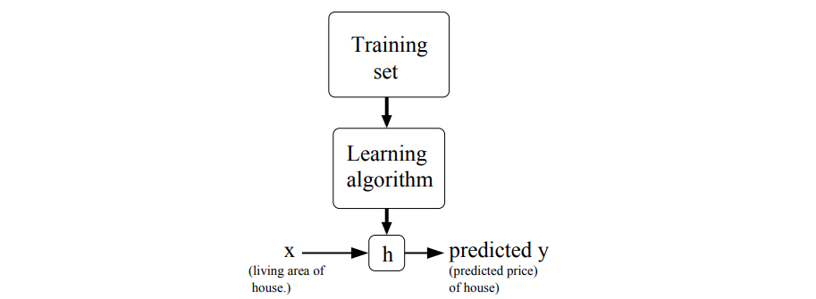

## 开始之前

**学习路线图**  
- **监督学习**：线性回归、逻辑回归、广义线性模型（GLM）、生成式学习（高斯判别分析和朴素贝叶斯）、支持向量机（SVM）。  
- **学习理论**：偏差-方差权衡、正则化方法、模型选择策略。  
- **深度学习**：树集成方法、神经网络基础、反向传播（backpropagation）。  
- **无监督学习**：K 均值聚类（K-means）、EM 算法、主成分分析（PCA）、独立成分分析（ICA）。  
- **强化学习**：马尔可夫决策过程（MDP）、贝尔曼方程（Bellman equations）、线性二次调节（LQR）与线性二次高斯控制（LQG）、Q 学习（Q-learning）。  

**参考资料**：
- [课程仓库（2018秋）](https://github.com/maxim5/cs229-2018-autumn)  
- [详解正规方程（Normal Equation）](https://zhuanlan.zhihu.com/p/60719445?spm=a2c6h.13046898.0.0.7e436ffaYvMwh0)
- [机器学习中的数学理论1：三步搞定矩阵求导](https://zhuanlan.zhihu.com/p/262751195)
- [matrix vector derivatives for machine learning](https://daiwk.github.io/assets/matrix+vector+derivatives+for+machine+learning.pdf)

我没有听课，只看了笔记，完成了作业。

---

## 监督学习

要训练一个监督学习模型，我们首先选择一个*假设函数* $h$，它将输入特征 $x$ 映射为预测的目标输出 $y$：  
$$
    h_{\theta}(x) = \sum_{i = 0}^n \theta_i x_i = \theta^T x
$$  
参数 $\theta_i$（通常称为*权重*）决定了模型的行为。

为了衡量这些权重在训练数据上的拟合程度，我们定义一个*损失函数*：  
$$
    J(\theta) = \dfrac{1}{2}\sum_{i = 1}^m \big(h_\theta(x^{(i)}) - y^{(i)}\big)^2
$$  
这就是经典的*普通最小二乘*（OLS）目标：它计算模型预测值与真实标签之间误差的平方均值。

### 第一部分：线性回归



#### 1. LMS 算法
**LMS** 是 **Least Mean Squares** 的缩写。

LMS 算法（也称为 **Widrow-Hoff** 学习规则）是一种基于**梯度下降**的参数更新规则。它的目标是调整模型的参数 $\theta$，使得预测值 $h_\theta(x)$ 与真实值 $y$ 之间的**均方误差**（Square Error）最小化。

LMS 的更新规则如下：
$$ \theta_j := \theta_j + \alpha (y^{(i)} - h_\theta(x^{(i)})) x_j^{(i)} $$

*   $\alpha$：**学习率**（Learning Rate），控制步长的大小。
*   $y^{(i)} - h_\theta(x^{(i)})$：**预测误差**（真实值减去预测值）。
*   $x_j^{(i)}$：第 $i$ 个样本的第 $j$ 个特征输入。

LMS 算法的两种实现（优化）方法：
1.  **批量梯度下降 (Batch Gradient Descent)**：看完全部数据后，算一个总的误差，再更新一次参数。
```python
# Core logic for Batch Gradient Descent
for _ in range(iterations):
    # Calculate predictions for the entire batch: h_theta(x)
    predictions = X @ theta 
    
    # Calculate the error vector: (y - h_theta(x))
    errors = y - predictions
    
    # Update all theta_j simultaneously using the sum of errors
    # X.T @ errors performs the summation: sum((y - h) * x_j)
    theta += alpha * (X.T @ errors)
```
2.  **随机梯度下降 (Stochastic Gradient Descent)**：每看一个数据样本，就立刻根据该样本的误差更新一次参数（通常收敛速度更快，适合大数据集）。这里的单次更新规则就是 LMS 规则。
```python
# Core logic for Stochastic Gradient Descent
for _ in range(epochs):
    for i in range(m):
        # Pick one specific example (x_i, y_i)
        xi = X[i]
        yi = y[i]
        
        # Calculate prediction for this single example
        prediction = xi @ theta
        
        # Update theta_j immediately based on this single error
        theta += alpha * (yi - prediction) * xi
```

| 特性 | 批量梯度下降 (Batch Gradient Descent) | 随机梯度下降 (Stochastic Gradient Descent) |
| :--- | :--- | :--- |
| **单步更新数据量** | 使用**整个训练集**（所有 $m$ 个样本）来计算梯度并更新参数。 | 每次仅使用**一个训练样本** $(x^{(i)}, y^{(i)})$ 来计算梯度并更新参数。 |
| **计算成本 (单步)** | **高**。每走一步都需要遍历所有数据，如果数据集很大 ($m$ 大)，计算非常耗时,。 | **低**。每看一个样本就更新一次，计算极快。 |
| **收敛速度** | 单步慢，但方向准确。在数据量大时，到达最小值的总时间可能较长。 | **通常更快**接近最小值。不需要扫描全数据集即可开始优化，特别是在 $m$ 很大时效率更高。 |
| **收敛稳定性** | **稳定**。直接沿着最陡下降方向移动。对于凸问题（如线性回归），保证收敛到全局最优解（假设学习率合适）。 | **震荡**。参数更新方向仅基于单个样本，可能不代表整体最优方向。它会在最小值附近持续震荡，可能永远不会收敛到某一点，但在实践中通常能得到足够好的近似解。 |
| **别名** | 标准梯度下降 (Standard Gradient Descent) | 增量梯度下降 (Incremental Gradient Descent) |
| **适用场景** | 较小的数据集，或对收敛精度要求极高的情况。 | 大规模数据集 ($m$ 很大)，或需要快速得到一个近似解的情况。 |

> **补充说明：**
> 除了这两种极端情况，深度学习讲义中还提到了折中的 **小批量梯度下降 (Mini-batch Gradient Descent)**，即每次更新使用 $B$ 个样本（$1 < B < m$），这在实际应用中非常常见。

#### 2. 正规方程

:::tip[和 LMS 的区别]
简单来说，**正规方程（Normal Equations）** 和 **LMS 算法（Least Mean Squares）** 是解决同一个问题（最小化平方误差代价函数 $J(\theta)$）的两种**截然不同**的方法。

以下是具体的区别和解释：

**I. 本质区别**
*   **LMS 算法**：属于**迭代法**（Iterative Algorithm）。它使用**梯度下降**（Gradient Descent）。它像下山一样，通过一步步不断调整参数 $\theta$ 来逼近最小误差值。
*   **正规方程**：属于**解析法**（Analytical Method）或闭式解（Closed-form Solution）。它利用**矩阵求导**，直接计算出让导数为 0 的那个点，一步到位求出最优的 $\theta$，不需要迭代循环。

**II. 数学实现**
*   **LMS 算法**：
    *   核心是**更新规则**：$\theta_j := \theta_j + \alpha (y^{(i)} - h_\theta(x^{(i)}))x_j^{(i)}$。
    *   它需要选择一个**学习率** $\alpha$（步长），如果 $\alpha$ 选得不好，可能会导致收敛很慢或者震荡。
    *   包含批量梯度下降（Batch Gradient Descent）和随机梯度下降（Stochastic Gradient Descent）两种形式。

*   **正规方程**：
    *   核心是**求导置零**：利用矩阵微积分的工具，直接对代价函数 $J(\theta)$ 求导，并令梯度 $\nabla_\theta J(\theta) = 0$。
    *   最终公式：$\theta = (X^T X)^{-1} X^T \vec{y}$。
    *   它**不需要**选择学习率 $\alpha$，也不需要循环。

**III. 优缺点对比（补充背景）**
虽然正规方程看起来“一步到位”很完美，但在实际应用中两者各有优劣：
*   **正规方程**：需要计算矩阵的逆 $(X^T X)^{-1}$。如果特征数量 $n$ 非常大（例如 $n > 10,000$），计算逆矩阵的代价非常高（计算复杂度约为 $O(n^3)$），这时候正规方程会很慢。
*   **LMS / 梯度下降**：虽然需要多次迭代，但在特征数量非常大的情况下，往往比计算巨型矩阵的逆要快得多。
:::

:::note[数学基础：矩阵求导与迹]
所谓矩阵求导，本质上只不过是多元函数求导，仅仅是把把函数的自变量以及求导的结果排列成了矩阵的形式，方便表达与计算而已。

**I. 基础符号与定义**
*   **矩阵梯度 (Matrix Gradient):**
    对于函数 $f: \mathbb{R}^{m \times n} \mapsto \mathbb{R}$（输入为矩阵，输出为实数），其关于矩阵 $A$ 的导数定义为：
    $$
    \nabla_A f(A) = \begin{bmatrix}
    \frac{\partial f}{\partial A_{11}} & \cdots & \frac{\partial f}{\partial A_{1n}} \\
    \vdots & \ddots & \vdots \\
    \frac{\partial f}{\partial A_{m1}} & \cdots & \frac{\partial f}{\partial A_{mn}}
    \end{bmatrix}
    $$
    即 $(i, j)$ 元素为 $\frac{\partial f}{\partial A_{ij}}$。

*   **迹 (Trace):**
    对于 $n \times n$ 方阵 $A$，迹是其对角元素之和：
    $$
    \text{tr} A = \sum_{i=1}^n A_{ii}
    $$

**II. 迹算子 (Trace) 的关键性质**
1.  **实数的迹:** 如果 $a$ 是实数，$\text{tr } a = a$。
2.  **转置不变性:** $\text{tr} A = \text{tr} A^T$。
3.  **线性性质:**
    *   $\text{tr}(A + B) = \text{tr} A + \text{tr} B$
    *   $\text{tr}(aA) = a\,\text{tr} A$
4.  **循环置换性质 (Cyclic Property):** 只要矩阵维度允许相乘，矩阵乘积的迹允许循环移位：
    $$
    \text{tr}(AB) = \text{tr}(BA)
    $$
    推广：$\text{tr}(ABC) = \text{tr}(CAB) = \text{tr}(BCA)$。

**III. 矩阵求导常用公式**
1.  **线性形式的导数:**
    $$
    \nabla_A \text{tr}(AB) = B^T
    $$
2.  **转置函数的导数:**
    $$
    \nabla_{A^T} f(A) = (\nabla_A f(A))^T
    $$
3.  **二次型的导数 (核心公式):**
    $$
    \nabla_A \text{tr}(ABA^TC) = CAB + C^TAB^T
    $$
4.  **行列式的导数 (用于最大似然估计等):**
    $$
    \nabla_A |A| = |A|(A^{-1})^T
    $$
:::

为了使用上述工具，首先需要将线性回归的代价函数 $J(\theta)$ 写成矩阵向量的形式。

*   **设计矩阵 (Design Matrix) $X$**：将所有 $m$ 个训练样本的输入特征作为行向量堆叠起来，形成一个 $m \times n$ 的矩阵。
*   **目标向量 $\vec{y}$**：将所有训练样本的标签堆叠成一个 $m$ 维向量。

此时，预测误差向量可以表示为 $X\theta - \vec{y}$。
代价函数（最小二乘法）可以重写为：
$$ J(\theta) = \frac{1}{2}(X\theta - \vec{y})^T (X\theta - \vec{y}) $$

**正规方程的推导过程 (Derivation)**

推导的目标是找到使 $\nabla_\theta J(\theta) = 0$ 的 $\theta$ 值。

- **步骤 1：利用迹算子展开**

    因为 $J(\theta)$ 计算出来是一个实数（scalar），根据性质“实数的迹等于其本身”，我们可以给方程加上迹算子以便于使用矩阵求导公式：
$$ \nabla_\theta J(\theta) = \nabla_\theta \text{tr} \left( \frac{1}{2}(X\theta - \vec{y})^T (X\theta - \vec{y}) \right) $$

    展开括号内的项：
$$ \frac{1}{2} \nabla_\theta \text{tr} (\theta^T X^T X \theta - \theta^T X^T \vec{y} - \vec{y}^T X \theta + \vec{y}^T \vec{y}) $$

- **步骤 2：简化中间项**

    利用性质 $\text{tr} A = \text{tr} A^T$，我们可以发现中间两项是相等的（因为它们都是标量）：
$$ \text{tr}(\theta^T X^T \vec{y}) = \text{tr}( (\theta^T X^T \vec{y})^T ) = \text{tr}(\vec{y}^T X \theta) $$
    因此，这两项可以合并为 $-2\text{tr}(\vec{y}^T X \theta)$。

- **步骤 3：对各项求导**

    现在我们需要对以下各项关于 $\theta$ 求导：
    1. **常数项**：$\vec{y}^T \vec{y}$ 与 $\theta$ 无关，导数为 0。
    2. **线性项**：$-2\text{tr}(\vec{y}^T X \theta)$。利用公式 $\nabla_A \text{tr}(AB) = B^T$（令 $A=\theta, B=\vec{y}^TX$），或者直接利用讲义推导结果，这一项的导数是 $-2 X^T \vec{y}$。
    3. **二次项**：$\text{tr}(\theta^T X^T X \theta)$。利用公式 $\nabla_A \text{tr}(ABA^TC)$，令 $A=\theta, B=X^TX, C=I$。此时公式变为 $X^TX\theta + (X^TX)^T\theta = 2X^TX\theta$（因为 $X^TX$ 是对称矩阵）。

- **步骤 4：组合并置零**

    将上述结果组合起来，得到 $J(\theta)$ 的梯度：
$$ \nabla_\theta J(\theta) = \frac{1}{2} (2X^T X \theta - 2X^T \vec{y}) = X^T X \theta - X^T \vec{y} $$

    令梯度为 0 以求极值：
$$ X^T X \theta - X^T \vec{y} = 0 $$
$$ X^T X \theta = X^T \vec{y} $$

    这就是**正规方程 (Normal Equations)**。

**最终结论**

通过求解正规方程，我们可以直接得到最优参数 $\theta$ 的闭式解（Closed-form solution）：

$$ \theta = (X^T X)^{-1} X^T \vec{y} $$

这一节的结论是：如果 $X^TX$ 是可逆的，我们不需要进行任何迭代（如梯度下降），只需要通过一次矩阵运算即可直接算出使代价函数最小的 $\theta$ 值。


#### 3. 概率视角  
为什么线性回归通常使用“最小二乘法”（Least Mean Squares）作为损失函数。

这种解释的核心逻辑在于：**最小二乘回归（Least Squares Regression）等价于在高斯噪声假设下的最大似然估计（Maximum Likelihood Estimation, MLE）。**

以下是详细的推导步骤：

1. 回归最基本的假设：误差的来源

    首先，我们不直接假设损失函数是什么，而是从数据的生成过程开始假设。
    假设输入 $x$ 和输出 $y$ 之间存在线性关系，但这种关系不是完美的，受到某种“误差”或“噪声” $\epsilon$ 的干扰。即：
$$ y^{(i)} = \theta^T x^{(i)} + \epsilon^{(i)} $$，其中 $\epsilon^{(i)}$ 是误差项，代表了未建模的影响因素或随机噪声。

2. 定义误差的性质：高斯分布

    根据第一性原理，我们需要描述这个误差 $\epsilon$ 长什么样。
    假设误差 $\epsilon^{(i)}$ 是**独立同分布（IID）**的，并且服从**均值为 0、方差为 $\sigma^2$ 的高斯分布（正态分布）**。
    写作：$\epsilon^{(i)} \sim \mathcal{N}(0, \sigma^2)$。

    这意味着误差的概率密度函数（PDF）为：
$$ p(\epsilon^{(i)}) = \frac{1}{\sqrt{2\pi}\sigma} \exp\left(-\frac{(\epsilon^{(i)})^2}{2\sigma^2}\right) $$

3. 推导目标变量的条件概率

    既然 $y^{(i)} = \theta^T x^{(i)} + \epsilon^{(i)}$，且 $\epsilon^{(i)}$ 是高斯的，那么在给定 $x^{(i)}$ 和参数 $\theta$ 的条件下，$y^{(i)}$ 也服从高斯分布。
    *   均值：$E[y^{(i)}] = \theta^T x^{(i)} + E[\epsilon^{(i)}] = \theta^T x^{(i)}$
    *   方差：$\text{Var}(y^{(i)}) = \text{Var}(\epsilon^{(i)}) = \sigma^2$

    所以，$y^{(i)}$ 的条件概率密度函数可以写为：
$$ p(y^{(i)}|x^{(i)}; \theta) = \frac{1}{\sqrt{2\pi}\sigma} \exp\left(-\frac{(y^{(i)} - \theta^T x^{(i)})^2}{2\sigma^2}\right) $$
    这一步建立了模型预测值与真实值之间概率关系的桥梁。

4. 建立似然函数 (Likelihood)

    现在的目标是找到一组参数 $\theta$，使得我们在现实中观察到的由于 $x$ 产生 $y$ 的这组数据出现的 **概率最大**。这就是 **最大似然估计（MLE）** 的原则。

    定义**似然函数** $L(\theta)$ 为所有观测样本的联合概率密度。由于样本是独立的（IID），联合概率等于各样本概率的乘积：
$$ L(\theta) = p(\vec{y}|X; \theta) = \prod_{i=1}^{m} p(y^{(i)}|x^{(i)}; \theta) $$
    代入上面的高斯分布公式：
$$ L(\theta) = \prod_{i=1}^{m} \frac{1}{\sqrt{2\pi}\sigma} \exp\left(-\frac{(y^{(i)} - \theta^T x^{(i)})^2}{2\sigma^2}\right) $$


5. 化简优化目标：对数似然 (Log Likelihood)

    为了数学上计算方便（将乘积转化为求和），我们对似然函数取对数，得到 **对数似然函数** $\ell(\theta)$。因为对数函数是单调递增的，最大化 $L(\theta)$ 等价于最大化 $\ell(\theta)$：
$$ \begin{aligned} \ell(\theta) &= \log L(\theta) \\ &= \log \prod_{i=1}^{m} \frac{1}{\sqrt{2\pi}\sigma} \exp\left(-\frac{(y^{(i)} - \theta^T x^{(i)})^2}{2\sigma^2}\right) \\ &= \sum_{i=1}^{m} \log \left[ \frac{1}{\sqrt{2\pi}\sigma} \exp\left(-\frac{(y^{(i)} - \theta^T x^{(i)})^2}{2\sigma^2}\right) \right] \\ &= m \log \frac{1}{\sqrt{2\pi}\sigma} - \frac{1}{\sigma^2} \cdot \frac{1}{2} \sum_{i=1}^{m} (y^{(i)} - \theta^T x^{(i)})^2 \end{aligned} $$


6. 结论：最小二乘法的必然性

    现在我们要**最大化**这个对数似然 $\ell(\theta)$。观察上式：
    1.  第一项 $m \log \frac{1}{\sqrt{2\pi}\sigma}$ 是一个常数（相对于 $\theta$ 而言），不影响极值点。
    2.  第二项前面的系数 $\frac{1}{\sigma^2}$ 是正的常数，也不影响极值点。
    3.  要让 $\ell(\theta)$ **最大**，必须让减号后面的项 **最小**。

    因此，最大化似然函数等价于**最小化**以下式子：$$ \frac{1}{2} \sum_{i=1}^{m} (y^{(i)} - \theta^T x^{(i)})^2 $$，这正是我们熟悉的**最小二乘成本函数** $J(\theta)$。

**总结**

**如果我们假设数据中的误差服从独立同分布的高斯分布，那么寻找“最佳”参数（即最能解释数据的参数）的过程，在数学上完全等同于执行最小二乘法回归**。这为看似随意的“平方误差”提供了坚实的概率论基础。

#### 4. 局部加权线性回归  

在第一性原理下，我们首先审视数据的本质。当我们试图用模型去拟合数据时，面临两个基本矛盾：
*   **线性假设的局限（欠拟合）：** 如果我们假设数据完全服从一条直线（$y = \theta_0 + \theta_1x$），但实际数据有弯曲特征，模型就会出现“欠拟合”（Underfitting）。它无法捕捉数据的局部结构。
*   **高维特征的风险（过拟合）：** 为了捕捉弯曲，我们可以增加高阶特征（如 $x^2, x^3...x^5$）。虽然这能让曲线完美经过所有点，但会导致曲线在无数据区域剧烈震荡，无法预测新数据，这叫“过拟合”（Overfitting）。

> **第一性原理推论：** 如果我们不能假设数据在全局上符合某个特定的函数形状（如直线或抛物线），我们就应该放弃寻找一个“放之四海而皆准”的全局参数 $\theta$。相反，我们应该假设：**函数关系在局部是简单的（线性的），但在全局是复杂的。**

基于上述推论，LWR 建立在一个核心公理之上：**对于一个查询点 $x$（我们要预测的点），只有距离它最近的训练样本是有效的，距离越远的样本参考价值越低**。

在标准线性回归中，为了求出参数 $\theta$，我们最小化的是所有样本的均方误差之和：
$$ J(\theta) = \sum_i (y^{(i)} - \theta^T x^{(i)})^2 $$
这意味着所有样本对 $\theta$ 的决定权是平等的。

但在 LWR 中，基于**局部性原理**，我们需要修改这个公理。我们需要给每个样本赋予一个权重 $w^{(i)}$，这个权重取决于样本 $x^{(i)}$ 与我们要预测的点 $x$ 之间的距离。

因此，我们的**目标函数**变成了针对特定查询点 $x$ 的加权形式：
$$ \text{Minimize} \sum_i w^{(i)} (y^{(i)} - \theta^T x^{(i)})^2 $$
这里，权重 $w^{(i)}$ 越大，该样本对 $\theta$ 的拟合影响就越大；权重接近 0，该样本就被模型“忽略”。

我们需要一个数学函数来描述“距离越远，权重越小”。Note 1 中给出了标准的选择，即类似高斯分布的指数衰减函数：
$$ w^{(i)} = \exp\left( - \frac{(x^{(i)} - x)^2}{2\tau^2} \right) $$


对该公式的第一性原理解析：
*   **距离度量**：$(x^{(i)} - x)^2$ 衡量了训练样本与查询点的距离。
*   **衰减机制**：$exp(-z)$ 函数保证了当距离为 0 时，权重为 1（最大）；当距离趋向无穷大时，权重趋向 0。
*   **波宽参数 ($\tau$, Bandwidth)**：$\tau$ 控制了衰减的速度。$\tau$ 越小，权重衰减越快，模型只关注极近的邻居（容易过拟合）；$\tau$ 越大，关注范围越广（趋向于标准线性回归）。
*   **非概率性**：虽然公式长得像高斯分布，但这里的 $w^{(i)}$ 并不是随机变量，也不需要积分等于 1。

**算法执行**

标准线性回归是 **参数化（Parametric）** 算法：算出 $\theta$ 后，数据就可以丢掉了。
LWR 是 **非参数化（Non-parametric）** 算法。因为 $\theta$ 依赖于查询点 $x$，所以不存在一个通用的 $\theta$。

**LWR 的工作流程（预测 $x$ 时）：**
1.  **输入**：查询点 $x$ 和整个训练集。
2.  **计算权重**：利用上述指数公式，计算训练集中每个点相对于 $x$ 的权重 $w^{(i)}$。
3.  **局部拟合**：求解最小化加权误差的 $\theta$。注意，这个 $\theta$ 是专门为这个 $x$ “定制”的。
4.  **输出**：$\theta^T x$。
5.  **重置**：如果要预测下一个点 $x'$，必须重复上述所有步骤，重新计算一个新的 $\theta$。

**总结**

从第一性原理来看，**局部加权线性回归（LWR）** 是对标准线性回归的一种修正，它 **抛弃了“单一全局模型”的假设**，转而采用 **“以数据为中心，按距离加权”** 的策略。它不需要提前训练出一个固定的参数集，而是每次预测时，根据查询点的位置，临时在数据集中划定一个“势力范围”（由 $\tau$ 控制），并在该范围内进行线性拟合。

这种方法的代价是计算成本高（预测时需要遍历整个数据集），但收益是能够极好地拟合非线性的复杂数据结构。

### 第二部分 分类与逻辑回归  
主要研究二元分类问题。

#### 1. 逻辑回归

我们面对的是分类问题，目标变量 $y$ 是离散的（例如 $y \in \{0, 1\}$）。
如果直接使用线性回归，预测值会超出 $1$ 的范围，这违反了“概率”的基本定义，且对异常值敏感。

**构建模型**：
我们需要一个函数将线性预测值 $\theta^T x$ “压缩”到 $(0, 1)$ 之间。所以引入了 **Sigmoid 函数**（也称为 Logistic 函数）：$$g(z) = \frac{1}{1 + e^{-z}}$$

因此，逻辑回归的假设函数（Hypothesis）被定义为：
$$ h_\theta(x) = g(\theta^T x) = \frac{1}{1 + e^{-\theta^T x}} $$
这个函数的选择看似随意，但 Note 1 后来（在 GLM 部分）揭示了这是由伯努利分布的正则形式自然导出的。

2. 核心假设：数据服从伯努利分布

既然 $y$ 只能取 0 或 1，我们不能假设误差服从高斯分布（像线性回归那样）。我们需要假设数据服从**伯努利分布（Bernoulli Distribution）**。

我们将 $h_\theta(x)$ 解释为在给定 $x$ 下 $y=1$ 的概率：
*   $P(y=1|x; \theta) = h_\theta(x)$
*   $P(y=0|x; \theta) = 1 - h_\theta(x)$

为了便于后续计算，我们将这两个式子合并为一个紧凑的概率质量函数：
$$ p(y|x; \theta) = (h_\theta(x))^y (1 - h_\theta(x))^{1-y} $$

当 $y=1$ 时，结果为 $h_\theta(x)$；当 $y=0$ 时，结果为 $1-h_\theta(x)$。

3. 优化目标：最大似然估计 (MLE)
我们如何定义“最好的参数 $\theta$”？最好的参数应该是让**已经观测到的数据出现的概率最大**的那组参数。

**推导似然函数**：
假设样本是独立同分布（IID）的，整个数据集的似然函数 $L(\theta)$ 就是所有样本概率的乘积：
$$ L(\theta) = \prod_{i=1}^{m} p(y^{(i)}|x^{(i)}; \theta) = \prod_{i=1}^{m} (h_\theta(x^{(i)}))^{y^{(i)}} (1 - h_\theta(x^{(i)}))^{1-y^{(i)}} $$

**对数似然**：
为了将乘法转化为加法以方便求导，我们最大化**对数似然函数** $\ell(\theta)$：
$$ \ell(\theta) = \sum_{i=1}^{m} \left[ y^{(i)} \log h_\theta(x^{(i)}) + (1-y^{(i)}) \log (1 - h_\theta(x^{(i)})) \right] $$
这就是逻辑回归的目标函数。与线性回归最小化误差不同，这里我们要**最大化**这个概率。

4. 求解参数：梯度上升法 (Gradient Ascent)
为了找到能使 $\ell(\theta)$ 最大的 $\theta$，我们沿梯度的方向更新参数。

**求导过程**：
这涉及到对 Sigmoid 函数求导。Sigmoid 函数有一个完美的导数性质：$g'(z) = g(z)(1-g(z))$。
利用链式法则对 $\ell(\theta)$ 求偏导：
$$ \frac{\partial}{\partial \theta_j} \ell(\theta) = \sum_{i=1}^{m} (y^{(i)} - h_\theta(x^{(i)})) x_j^{(i)} $$

**更新规则**（随机梯度上升）：
$$ \theta_j := \theta_j + \alpha (y^{(i)} - h_\theta(x^{(i)})) x_j^{(i)} $$

**深刻的洞察**：
这个更新规则在形式上与线性回归的 LMS（最小均方）规则**完全一致**。
*   线性回归：$y - \theta^T x$
*   逻辑回归：$y - g(\theta^T x)$

这种一致性并非巧合，而是因为它们都属于**广义线性模型（GLM）**，且都使用了各自分布对应的正则链接函数（Canonical Link Function）。

总结
1.  **假设**：数据服从伯努利分布。
2.  **建模**：使用 Sigmoid 函数将线性输出映射为概率。
3.  **目标**：最大化观测数据的似然概率。
4.  **结果**：导出了一套参数更新机制，其核心形式与线性回归惊人地一致，揭示了统计学习模型背后的统一数学美感。

:::note[感知机学习算法]
与逻辑回归试图模拟“概率”不同，感知机的第一性原理基于**“生物神经元的硬性决策”**机制。

以下是详细的推导和说明：

1. 核心假设：从“概率”回归到“硬阈值”
**第一性原理出发点**：在某些情况下，我们不需要知道某件事发生的概率是 70% 还是 80%，我们只需要一个明确的决策结果：**是 (1) 还是 否 (0)**。

**数学构建**：
为了实现这种“非黑即白”的决策，感知机抛弃了逻辑回归中平滑的 Sigmoid 函数，转而使用**阶跃函数（Threshold Function / Step Function）**作为激活函数 $g(z)$：
$$ g(z) = \begin{cases} 1 & \text{if } z \ge 0 \\ 0 & \text{if } z < 0 \end{cases} $$

因此，假设函数 $h_\theta(x)$ 变成了：
$$ h_\theta(x) = g(\theta^T x) $$
这意味着：如果加权和 $\theta^T x$ 大于等于 0，预测为 1；否则预测为 0。

2. 学习机制：基于误差的直接修正
**第一性原理出发点**：既然函数是离散的阶跃函数，其导数在大部分地方为 0，在 0 处不可导。因此，我们**不能**像逻辑回归那样使用微积分（链式法则）来推导梯度下降。我们需要回到最原始的学习直觉：**犯错就改，没错保持**。

**构建更新规则**：
虽然讲义指出感知机的更新规则在形式上与逻辑回归和线性回归惊人地相似，但其背后的物理意义完全不同：
$$ \theta_j := \theta_j + \alpha (y^{(i)} - h_\theta(x^{(i)})) x_j^{(i)} $$

让我们用第一性原理拆解这个规则为何有效：
*   **情况 A：预测正确**
    如果 $y^{(i)} = h_\theta(x^{(i)})$（例如都是 1 或都是 0），那么 $(y - h) = 0$。参数 $\theta$ **不发生变化**。这符合直觉：模型做对了，就不需要修改。
*   **情况 B：漏报（False Negative）**
    如果 $y^{(i)} = 1$ 但 $h_\theta(x^{(i)}) = 0$。这说明 $\theta^T x$ 太小了（小于 0）。
    误差项 $(y - h) = 1 - 0 = 1$。
    更新规则变为：$\theta := \theta + \alpha x$。
    **直觉**：通过加上输入向量 $x$，我们增大了 $\theta^T x$ 的值，使其更倾向于跨过 0 的门槛变成正数，从而修正预测。
*   **情况 C：误报（False Positive）**
    如果 $y^{(i)} = 0$ 但 $h_\theta(x^{(i)}) = 1$。这说明 $\theta^T x$ 太大了（大于 0）。
    误差项 $(y - h) = 0 - 1 = -1$。
    更新规则变为：$\theta := \theta - \alpha x$。
    **直觉**：通过减去输入向量 $x$，我们减小了 $\theta^T x$ 的值，使其更倾向于变成负数，从而修正预测。

3. 历史与本质：神经元模型 vs. 概率模型
**第一性原理视角**：感知机是对大脑单个神经元工作方式的**粗糙模拟**。
*   **生物学原理**：神经元接收电信号，如果电位总和超过某个阈值，神经元就“触发”（fire，输出 1）；否则保持静默（输出 0）。感知机完全对应这一过程。

**与逻辑回归的本质区别**：
虽然更新公式 $y - h_\theta(x)$ 看起来一样，但这是一种“表面上的相似”（cosmetically similar）：
*   **逻辑回归**：基于**最大似然估计（MLE）**和概率论导出。
*   **感知机**：基于**误差修正**算法。讲义特别强调，感知机**很难**赋予有意义的概率解释，也很难通过最大似然估计推导出来。它是一种不同类型的算法。

总结
Note 1 中的 Digression 部分通过第一性原理展示了感知机算法：它不追求复杂的概率建模，而是基于最简单的**“阈值判定”**假设，并采用一种直观的**“错误驱动”**机制来更新权重。它是后来神经网络和深度学习理论的重要基石。
:::

#### 2. 牛顿迭代法
这一部分的核心在于：**我们不仅利用当前位置的“坡度”（一阶导数），还要利用“坡度的变化率”（二阶导数/曲率），从而实现更精准的步长跳跃。**

以下是详细的推导过程：

牛顿法最初不是为了求极值设计的，而是为了**求方程的根（即让 $f(\theta) = 0$）**。

*   **几何直觉**：假设我们不知道函数 $f(\theta)$ 的全貌，只知道当前点 $\theta^{(t)}$ 的函数值 $f(\theta^{(t)})$ 和切线斜率 $f'(\theta^{(t)})$。
*   **线性近似**：我们假设函数在局部是一条直线（也就是当前点的切线）。
*   **求解**：这条切线与横轴（$y=0$）的交点，就是我们需要移动到的下一个位置 $\theta^{(t+1)}$。
    *   切线方程：$y - f(\theta^{(t)}) = f'(\theta^{(t)}) \cdot (\theta - \theta^{(t)})$
    *   令 $y=0$ 解出 $\theta$：
        $$ \theta^{(t+1)} = \theta^{(t)} - \frac{f(\theta^{(t)})}{f'(\theta^{(t)})} $$
这就是牛顿法的**更新规则**。它利用直线的几何性质，快速逼近零点。

在逻辑回归中，我们的目标是**最大化**对数似然函数 $\ell(\theta)$。

*   **微积分原理**：函数的极值点（最大值或最小值）出现在其**导数为 0** 的地方。
*   **映射关系**：
    *   我们要找 $\ell(\theta)$ 的最大值 $\rightarrow$ 等同于找导数 $\ell'(\theta)$ 的**零点**。
    *   令上一节中的 $f(\theta) = \ell'(\theta)$。
*   **代入更新规则**：
    $$ \theta^{(t+1)} = \theta^{(t)} - \frac{\ell'(\theta^{(t)})}{\ell''(\theta^{(t)})} $$
    这里，$\ell'(\theta)$ 告诉我们往哪个方向走（像梯度上升），而 $\ell''(\theta)$（二阶导数）告诉我们要走多远。

3. 升维：从“标量”到“矩阵”

现实中的逻辑回归参数 $\theta$ 是一个向量，而不是标量。我们需要将上述规则推广到多维空间。

*   **一阶导数 $\to$ 梯度向量 ($\nabla_\theta \ell(\theta)$)**：
    对应标量中的 $\ell'(\theta)$，即所有偏导数组成的向量。
*   **二阶导数 $\to$ Hessian 矩阵 ($H$)**：
    对应标量中的 $\ell''(\theta)$。这是一个 $n \times n$ 的矩阵，其中第 $i$ 行第 $j$ 列的元素是 $H_{ij} = \frac{\partial^2 \ell(\theta)}{\partial \theta_i \partial \theta_j}$。
*   **除法 $\to$ 矩阵求逆**：
    在矩阵运算中，除以一个数等同于乘以该矩阵的逆矩阵。

**最终推导出的多维牛顿法更新规则（Newton-Raphson）**：
$$ \theta := \theta - H^{-1} \nabla_\theta \ell(\theta) $$

4. 算法本质与优劣分析

运用第一性原理，我们可以深刻理解这种方法的本质：

*   **二次收敛 (Quadratic Convergence)**：
    *   **梯度上升（Gradient Ascent）** 相当于做**平面切线**（线性近似），每次只走一小步，逼近速度慢，需要很多次迭代。
    *   **牛顿法** 相当于做**抛物线拟合**（二次近似）。因为它利用了二阶导数（曲率）信息，它能“预知”函数弯曲的程度，从而一次跳跃到抛物线的极值点。
    *   结果：牛顿法通常只需要极少的迭代次数就能收敛（收敛速度极快）。

*   **计算代价 (Computational Cost)**：
    *   虽然迭代次数少，但**单次迭代极其昂贵**。
    *   原因在于 $H^{-1}$。计算一个 $n \times n$ 矩阵的逆，其计算复杂度通常是 $O(n^3)$。
    *   **结论**：如果特征数量 $n$ 较小，牛顿法是完美的（这种在逻辑回归中的应用也常被称为 **Fisher scoring**）；但如果 $n$ 非常大（例如处理图像像素），计算 Hessian 的逆矩阵将变得不可行，此时必须退回到梯度下降法。

**总结**

Note 1 中的这部分内容展示了：如果我们不仅仅满足于知道“往高处走”（梯度），而是进一步计算“地形的弯曲程度”（Hessian），我们可以构建出一个数学上更高级的**二阶优化算法**。它用**空间（计算 Hessian 逆的内存和算力）换取了时间（极少的迭代步数）**。

### 第三部分 广义线性模型

#### 1. 指数族  
在 **CS229 Note 1 Part III** 中，关于 **Exponential Family（指数族分布）** 的内容不仅仅是列出一堆公式，而是为了解决一个根本性的问题：**如何统一看似完全不同的机器学习模型（如线性回归和逻辑回归），并找到一种通用的方法来构造针对任意数据类型的模型？**

运用**第一性原理（First Principles）**，我们可以将这部分内容拆解为以下几个核心逻辑层面：

1. 第一性原理出发点：寻找概率分布的“通用基因”
我们在前两部分学了线性回归（假设数据服从高斯分布）和逻辑回归（假设数据服从伯努利分布）。
*   **问题**：如果我们遇到新问题，比如预测网站点击量（计数数据，服从泊松分布），或者预测等待时间（服从Gamma分布），难道每次都要重新发明一种算法吗？
*   **解决方案**：我们需要找到这些分布共同的数学本质。这一本质就是**指数族分布**。

**指数族分布的通用形式**定义如下：
$$ p(y; \eta) = b(y) \exp(\eta^T T(y) - a(\eta)) $$

通过第一性原理拆解这个公式的物理意义：
*   **$\eta$ (Natural Parameter, 自然参数)**：这是**最关键**的参数。它决定了分布的“形状”。在广义线性模型（GLM）中，我们的线性预测 $\theta^T x$ 直接控制的就是这个 $\eta$。
*   **$T(y)$ (Sufficient Statistic, 充分统计量)**：它代表数据 $y$ 中包含的“有效信息”。在大多数基础模型中（如高斯、伯努利），$T(y)$ 就直接等于 $y$ 本身。
*   **$a(\eta)$ (Log Partition Function, 对数配分函数)**：本质上是一个**归一化项**。它的存在是为了保证所有可能事件的概率之和（或积分）等于 1。
*   **$b(y)$ (Base Measure, 基测度)**：与参数 $\eta$ 无关的基础项。

2. 验证与推导：从“现象”回归到“本质”
讲义通过将我们熟悉的伯努利分布和高斯分布强制转化为上述通用形式，揭示了它们背后的隐藏属性。

A. 伯努利分布 (Bernoulli) —— 逻辑回归的起源
*   **原始形式**：$p(y;\phi) = \phi^y (1-\phi)^{1-y}$。这是一个关于均值 $\phi$ 的函数。
*   **转化过程**：利用 $\exp(\ln(x)) = x$ 的性质，将其改写为指数形式：
    $$ \begin{aligned} p(y) &= \exp(y \ln \phi + (1-y) \ln(1-\phi)) \\ &= \exp(y \ln(\frac{\phi}{1-\phi}) + \ln(1-\phi)) \end{aligned} $$
*   **提取本质 ($\eta$)**：对比通用公式，我们发现系数 $\ln(\frac{\phi}{1-\phi})$ 对应着自然参数 $\eta$。
    $$ \eta = \ln(\frac{\phi}{1-\phi}) $$
*   **第一性原理的深刻洞察**：
    如果我们反解 $\phi$（即 $y=1$ 的概率，也就是我们的预测目标），我们会得到：
    $$ \phi = \frac{1}{1 + e^{-\eta}} $$
    **结论**：这就是 **Sigmoid 函数**！这解释了逻辑回归为什么**必须**使用 Sigmoid 函数——这并非人为随意的选择，而是因为当我们假设数据服从伯努利分布，并试图用线性模型控制其自然参数时，Sigmoid 函数是数学推导的**必然结果**。

B. 高斯分布 (Gaussian) —— 线性回归的起源
*   **原始形式**：$p(y;\mu) = \frac{1}{\sqrt{2\pi}} \exp(-\frac{1}{2}(y-\mu)^2)$ （假设 $\sigma^2=1$ 以简化）。
*   **转化过程**：展开平方项并整理：
    $$ \exp(-\frac{1}{2}y^2 + y\mu - \frac{1}{2}\mu^2) = \exp(y\mu - \frac{1}{2}\mu^2) \cdot \exp(-\frac{1}{2}y^2) $$
*   **提取本质 ($\eta$)**：对比通用公式，我们发现 $T(y)=y$ 的系数是 $\mu$。
    $$ \eta = \mu $$
*   **第一性原理的深刻洞察**：
    由于在广义线性模型中，我们假设 $\eta = \theta^T x$。
    而在高斯分布中 $\eta = \mu$（均值）。
    所以：$\mu = \theta^T x$。
    **结论**：这解释了为什么线性回归直接用线性函数 $\theta^T x$ 来预测 $y$ 的均值。

3. 指数族分布的价值：通用的“造模配方”
理解了指数族分布，我们就拥有了构建广义线性模型（GLM）的**第一性原理配方（Recipe）**：

1.  **确定分布**：观察 $y$ 的类型（是二分类？是实数？还是计数？），确认其服从哪个指数族分布。
2.  **找出 $\eta$**：将该分布写成指数族通用形式，提取出自然参数 $\eta$。
3.  **建立连接**：假设自然参数 $\eta$ 与输入特征 $x$ 呈线性关系，即 $\eta = \theta^T x$。
4.  **反解预测函数**：由于我们的预测目标通常是 $E[y|x]$（即均值），我们需要找到 $\eta$ 与均值之间的关系（称为正则响应函数），从而得到假设函数 $h_\theta(x)$。

总结
Note 1 中关于 **Exponential Family** 的内容，从第一性原理上统一了各种回归和分类算法。它告诉我们：**Sigmoid 函数（逻辑回归）和线性函数（线性回归）其实是同一个数学框架（GLM）在不同概率分布假设（伯努利 vs 高斯）下的自然衍生品**。这为处理更复杂的数据类型（如多分类的 Softmax 回归，或计数的泊松回归）提供了坚实的理论基础。

#### 2. 构建广义线性模型（GLM）

基于 **CS229 Note 1 Part III (Sections 9, 9.1, 9.2, 9.3)**，我们可以运用**第一性原理（First Principles）**，将构建广义线性模型（GLM）的过程看作是一个从**数据本质**推导到**模型形式**的逻辑闭环。

这里的核心思想是：我们不再凭直觉选择模型（比如“我觉得这里应该用 Sigmoid 函数”），而是通过设定三个最基本的假设，让模型自然而然地“涌现”出来。

以下是深入浅出的详细解析：

---

### 第一性原理的基石：构建 GLM 的三个核心假设 (Section 9)

如果我们要预测一个变量 $y$，无论是房价（连续值）、邮件分类（0/1）还是多分类，我们都遵循同一套“食谱”。这套食谱由三个关于数据本质的假设组成：

#### 1. 数据的“物理”分布 (The Distribution)
**第一性原理**：首先承认 $y$ 的取值性质决定了它服从什么概率分布。
*   **假设**：给定输入 $x$ 和参数 $\theta$，目标变量 $y$ 服从**指数族分布（Exponential Family）**中的某一种。
    $$ y | x; \theta \sim \text{ExponentialFamily}(\eta) $$
    这里 $\eta$ 是**自然参数 (Natural Parameter)**，它是指数族分布中最本质的控制参数（比如控制高斯的均值，或伯努利的概率）。

#### 2. 预测的目标 (The Prediction Goal)
**第一性原理**：我们的模型 $h(x)$ 到底想输出什么？通常我们无法预测随机变量的具体取值，只能预测它的“平均表现”。
*   **假设**：我们的假设函数 $h(x)$ 输出的是 $y$ 的**期望值** (Expected Value)。
    $$ h(x) = E[y|x] $$
    (注：更严格地说是充分统计量 $T(y)$ 的期望，通常 $T(y)=y$)。

#### 3. 线性驱动机制 (The Linear Design Choice)
**第一性原理**：输入 $x$ 如何影响分布的内部参数 $\eta$？在没有更多信息时，最简单、最符合奥卡姆剃刀原则的假设是“线性关系”。
*   **假设**：自然参数 $\eta$ 与输入 $x$ 呈**线性关系**。
    $$ \eta = \theta^T x $$
    这是 GLM 中最关键的设计选择。

---

### 应用 1：推导线性回归 (Section 9.1 - Ordinary Least Squares)

让我们看看这套逻辑如何“变出”线性回归。

1.  **确定分布**：预测房价（连续值），假设 $y$ 服从**高斯分布** $\mathcal{N}(\mu, \sigma^2)$。
    *   在 Section 8 中我们已经推导出，对于高斯分布，其自然参数 $\eta$ 正好等于均值 $\mu$。即 **$\mu = \eta$**。
2.  **确定目标**：我们要预测期望值。
    $$ h(x) = E[y|x] = \mu $$
3.  **建立连接**：
    *   因为 $h(x) = \mu$，而 $\mu = \eta$。
    *   根据假设 3，$\eta = \theta^T x$。
    *   **推导结果**：
        $$ h(x) = \theta^T x $$
    
**结论**：线性回归之所以直接输出 $\theta^T x$，不是随意决定的，而是因为在高斯分布假设下，自然参数直接等于均值。

---

### 应用 2：推导逻辑回归 (Section 9.2 - Logistic Regression)

为什么逻辑回归必须用 Sigmoid 函数？第一性原理给出了完美解释。

1.  **确定分布**：二分类问题 ($y \in \{0, 1\}$)，假设 $y$ 服从**伯努利分布**。
    *   在 Section 8 中推导出，伯努利分布的自然参数 $\eta$ 与均值 $\phi$ (即 $y=1$ 的概率) 的关系是：$\eta = \log(\frac{\phi}{1-\phi})$。
    *   反解出 $\phi$，得到 **$\phi = \frac{1}{1 + e^{-\eta}}$**。
2.  **确定目标**：我们要预测期望值（即概率 $\phi$）。
    $$ h(x) = E[y|x] = \phi $$
3.  **建立连接**：
    *   因为 $h(x) = \phi$，且 $\phi = \frac{1}{1 + e^{-\eta}}$。
    *   将 $\eta = \theta^T x$ 代入。
    *   **推导结果**：
        $$ h(x) = \frac{1}{1 + e^{-\theta^T x}} $$

**结论**：Sigmoid 函数（即 $1/(1+e^{-z})$）是伯努利分布的**正则响应函数 (Canonical Response Function)**。一旦假设了数据是二分类的（伯努利），GLM 框架就**强制**我们使用 Sigmoid 函数。

---

### 应用 3：推导 Softmax 回归 (Section 9.3 - Softmax Regression)

如果是多分类问题（$y \in \{1, ..., k\}$），比如邮件分为 $k$ 类，如何建模？

1.  **确定分布**：多分类问题，假设 $y$ 服从**多项分布 (Multinomial Distribution)**。
    *   我们需要 $k-1$ 个参数来描述它（因为概率之和为 1）。
    *   推导其指数族形式，我们发现自然参数 $\eta_i$ 与类别概率 $\phi_i$ 的关系为：
        $$ \eta_i = \log(\frac{\phi_i}{\phi_k}) $$
        (其中 $\phi_k$ 是最后一个类别的概率)。
    *   **链接函数反解**：通过数学推导（利用 $\sum \phi_i = 1$），我们可以把 $\eta$ 映射回 $\phi$：
        $$ \phi_i = \frac{e^{\eta_i}}{\sum_{j=1}^k e^{\eta_j}} $$
        这正是我们熟悉的 **Softmax 函数**。

2.  **确定目标**：预测每个类别的概率 $p(y=i|x)$。
    $$ h(x) \approx [\phi_1, \phi_2, ..., \phi_{k-1}]^T $$

3.  **建立连接**：
    *   根据 GLM 假设，$\eta_i$ 是线性的，即 $\eta_i = \theta_i^T x$。
    *   **推导结果**：
        $$ p(y=i|x; \theta) = \frac{e^{\theta_i^T x}}{\sum_{j=1}^k e^{\theta_j^T x}} $$

**结论**：Softmax 回归不是凭空创造的，它是**逻辑回归在多项分布假设下的自然推广**。它同样遵循 GLM 的标准构建流程。

---

### 总结 (Deep yet Simple)

Note 1 Part III 的 **Constructing GLMs** 告诉我们，机器学习中的许多经典算法并非孤立存在，它们共享同一个**第一性原理（GLM 框架）**：

1.  **看数据**：确认 $y$ 的分布（高斯、伯努利、多项式...）。
2.  **找本质**：找出该分布的**自然参数 $\eta$**。
3.  **做映射**：用线性模型 $\theta^T x$ 去拟合 $\eta$。
4.  **得模型**：通过分布特有的**响应函数**（Identity, Sigmoid, Softmax），将线性结果转化回预测目标。

这就是为什么我们可以用统一的方法论来解决回归、二分类、多分类乃至计数预测（泊松回归）等各种问题。
